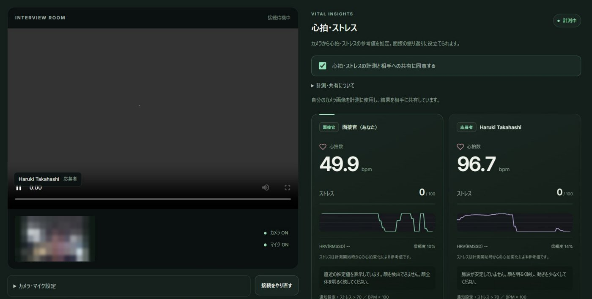
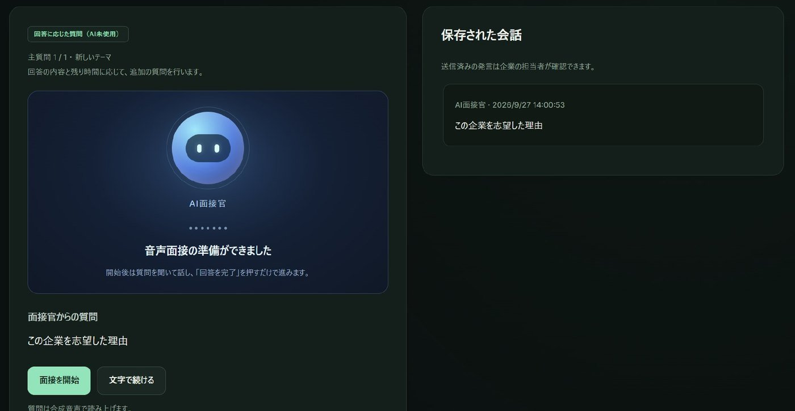
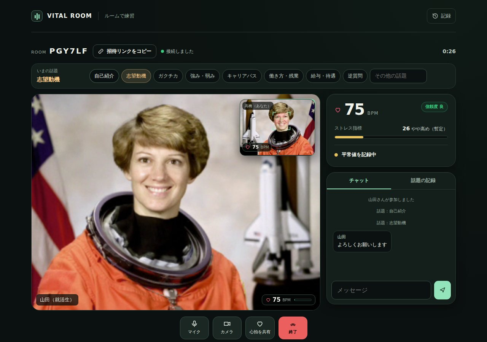
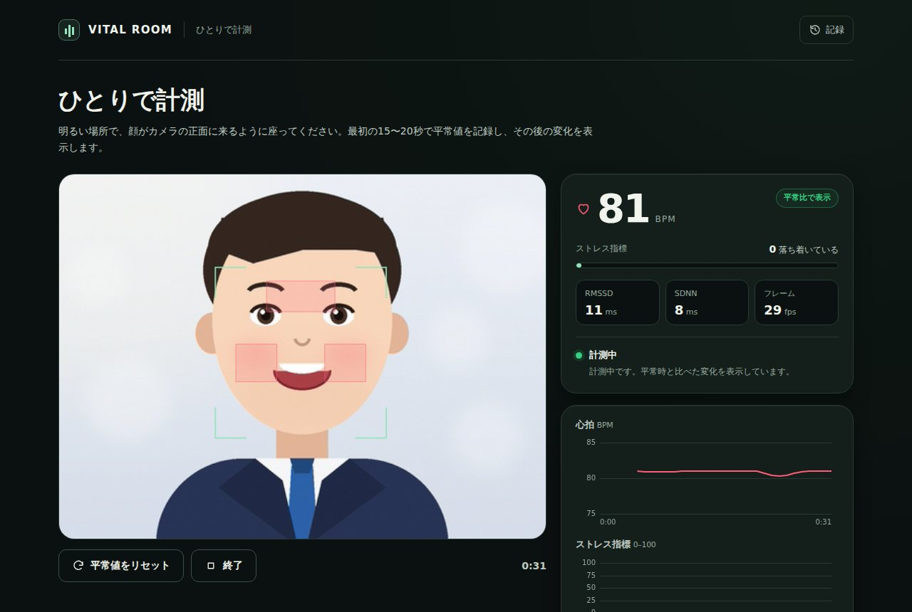

# VITAL ROOM — 緊張を、同意のうえで分かち合う面接ワークスペース

Web カメラの映像から **心拍数・心拍変動（HRV）・ストレスの目安** を非接触で推定し、**本人が同意したときだけ** 面接の相手と共有する面接ワークスペースです。
面接官と就活生のどちらも緊張している場で、その緊張を「見える形で分かち合う」ことで、より率直な対話を後押しすることを目指しました。嘘を見抜くためのツールではありません。

ハッカソンにチーム **「Life & Medical Hackers」** で参加し、開発しました。

**▶ ブラウザーで試す（Web 版）: https://haru-ki417.github.io/Harinezumi-AI-Hack/** 　インストール・登録不要。スマホ・タブレット・パソコンで使えます。

> 医療機器ではありません。表示する値は、照明・動き・カメラの性能の影響を受ける参考値です。診断・健康管理・採用の合否判断には使わないでください。

<table>
<tr>
<td width="50%"></td>
<td width="50%"></td>
</tr>
<tr><td align="center">フル版：対人面接ルーム（面接官と応募者、双方の心拍・ストレス）</td><td align="center">フル版：AI 音声面接（AI 面接官が質問を読み上げる）</td></tr>
<tr>
<td></td>
<td></td>
</tr>
<tr><td align="center">Web 版：2 人のルーム練習（P2P）</td><td align="center">Web 版：ひとりで計測</td></tr>
</table>

<sub>フル版の画面の小さな映像は、個人が分からないようにぼかしています。Web 版の映像は、動作確認用に描いたイラストの人物に脈拍を埋め込んだ合成映像です。</sub>

## 2 つの版

| | フル版（チームで開発） | Web 版（大会後に追加） |
|---|---|---|
| 置き場所 | [`vital-room/`](vital-room/)（`frontend/` Next.js ・ `backend/` FastAPI） | [`vital-room/web/`](vital-room/web/)（ビルド不要の静的サイト） |
| 動かし方 | サーバーを起動する（下の「使ってみる」） | ページを開くだけ |
| 心拍の計算 | サーバー（Python・numpy / scipy） | 端末のブラウザー（Python 版を JavaScript に移植） |
| 面接 | 企業向けの面接管理・応募者ごとの招待・対人面接・AI 音声面接・面接後の集計 | ひとりで計測・2 人のルーム練習・AI 面接練習 |
| データの保存 | サーバーの SQLite（同意した数値と発言） | その端末のブラウザーの中だけ |

Web 版は、フル版の信号処理（`backend/vital`）と面接の深掘り・振り返りのロジック（`interview_questions.py`・`interview_feedback.py`）を移植したものです。同じ入力を与えると、脈波・BPM・HRV・状態の移り変わり・質問の選択・振り返りの内容がフル版と一致することを確かめています。フル版のコードには手を加えていません。

## できること

### フル版

| | |
|---|---|
| **企業（面接官）** | 職種・対人 / AI・所要時間・質問・確認項目を設定し、応募者ごとの招待 URL と参加コードを発行。面接後は、発言の引用つきの集計を見ながら、担当者の判断とメモを残せる |
| **就活生** | 招待コードで参加。面接の方式と記録内容を確かめて同意し、カメラ・マイクを確認してから始める |
| **対人面接ルーム** | WebRTC の映像通話に、双方の心拍数・ストレスのメーター・推移を重ねて表示。リアルタイムの文字起こし、画面共有にも対応 |
| **AI 面接** | AI 面接官が質問を読み上げ、回答を文字起こし。回答に合わせて、行動・理由・結果の確かめ方・学びなどを最大 3 回深掘りする |
| **面接後の振り返り** | 就活生と企業の双方に、発言を引用した「伝わった点・補える点・質問ごとの回答の構成・次の練習」を表示 |
| **AI（任意）** | `OPENAI_API_KEY` を設定すると、追加の質問・集計・質問の音声を AI で作る。未設定や通信の失敗時は、規則による質問と集計で動く |

### Web 版

| | |
|---|---|
| **ひとりで計測** | 心拍・RMSSD・SDNN・平常時と比べたストレス指標をリアルタイムに表示。結果は CSV でも保存 |
| **ルームで練習** | ルームコードかリンクで 2 人をつなぐ（PeerJS / WebRTC）。話題（自己紹介・志望動機など）ごとに、お互いの心拍の変化を記録。映像通話つき・数値の共有だけ、を選べる |
| **AI 面接練習** | 質問セットか自作の質問で練習。読み上げ・音声入力に対応（文字入力でも可）。終了後に、発言を引用した振り返りを作る |
| **記録** | 保存した結果を、その端末のブラウザーの中で見返せる |

## しくみ

### 非接触バイタル（rPPG）

皮膚の色は、心拍に合わせてごくわずかに変わります。その変化をカメラの映像から読み取ります。

| 段階 | やり方 |
|---|---|
| 顔の領域 | 顔を検出し、額と両頬の領域から、YCrCb の肌色の範囲にある画素だけを平均する（目・口・髪・背景を避ける） |
| 脈波 | POS 法（Wang ほか, 2017）を約 1.6 秒の窓で重ね合わせ、線形のトレンドを除く |
| 心拍数 | 4 次の Butterworth 帯域通過（0.7〜4.0 Hz ＝ 42〜240 BPM）のあと、ハン窓・ゼロ詰めの FFT でピークを求め、放物線補間で細かく合わせる。帯域内の SNR から信頼度を出す |
| 心拍変動 | 12 秒以上・15 fps 以上のとき、ピークから拍の間隔を求めて RMSSD・SDNN を計算（外れた間隔は除く） |
| ストレスの目安 | 平常時（最初の値）と比べ、心拍が 25% 上がるか RMSSD が半分になると最大になる 0〜100 の指標。急な変化は「変化あり」として知らせる |

信頼度や SNR が低いとき、顔が見つからないとき、コマ数が足りないときは、値を確定せず「顔を検出できません」「脈波が安定していません」のように理由を表示します。

### 同意とプライバシー

- 参加前に、何を測り、だれに見えるかを示し、同意がないと計測・共有しない
- カメラの映像は保存しない。共有・保存するのは、同意した参加者の有効な数値だけ（1 秒に最大 1 件）
- 心拍・ストレスは AI の集計や振り返りに使わない。採用のスコアや合否、性格・適性の判定もしない
- 応募者に見えるのは自分の計測値だけで、企業の集計・判断・メモは公開しない

## 構成

```
vital-room/
├─ frontend/        フル版の画面（Next.js 14・WebRTC・Web Speech API）
├─ backend/         フル版のサーバー（FastAPI）
│  ├─ vital/        rPPG の信号処理（rppg.py・hrv.py・face.py・session.py・rooms.py）
│  └─ interview_*.py, hiring*.py   面接の進行・振り返り・企業向けの面接管理
├─ web/             Web 版（サーバー不要。js/ にフル版のロジックの移植）
├─ README.md        フル版の詳しい説明（エンドポイント・出力の指標・調整）
└─ INTERVIEWS.md    企業向け面接の使い方と設定
```

## 使ってみる

### Web 版

https://haru-ki417.github.io/Harinezumi-AI-Hack/ を開くだけです。手元で動かす場合は、`vital-room/web` で `python3 -m http.server 8080` を実行し、http://localhost:8080 を開きます（カメラは localhost か https でだけ動きます）。

### フル版

```bash
cd vital-room
docker compose up --build     # http://localhost:3000 （バックエンドは :8000）
```

Docker を使わない場合や、別の PC・スマートフォンから参加する場合の手順は [vital-room/README.md](vital-room/README.md#クイックスタート) と [INTERVIEWS.md](vital-room/INTERVIEWS.md) にあります。AI を使う場合は、バックエンドの環境変数 `OPENAI_API_KEY` を設定します（キーはソースコードに書かず、バックエンドだけが使います）。

## テスト

```bash
cd vital-room/backend && python test_rppg.py && python test_rooms.py   # フル版の信号処理・ルーム
cd vital-room/web && node --test tests/*.test.mjs                       # Web 版のロジック
```

`main` に push すると、GitHub Actions が Web 版のテストを実行し、GitHub Pages に公開します。

## 精度の限界

rPPG は照明・動き・カメラの性能に左右され、HRV はカメラのコマ数による時間の細かさの制約から近似値です。正しさを示すには、パルスオキシメーターなどの正解値と比べた「±X BPM」を実測して示す必要があります（今後の課題）。
