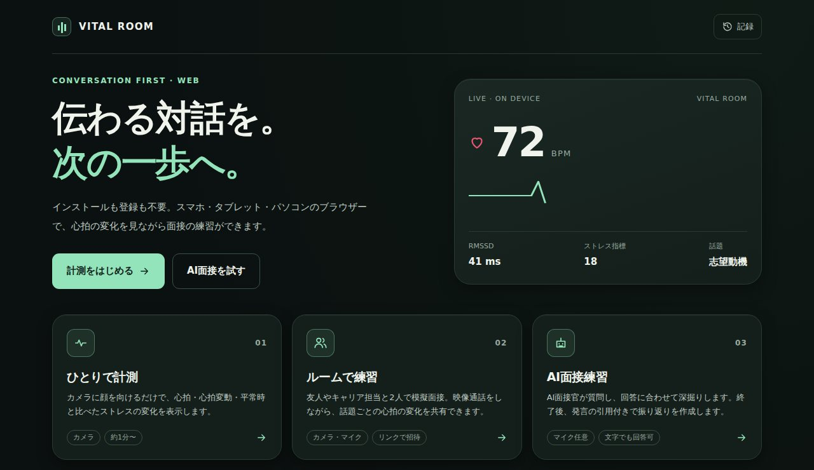
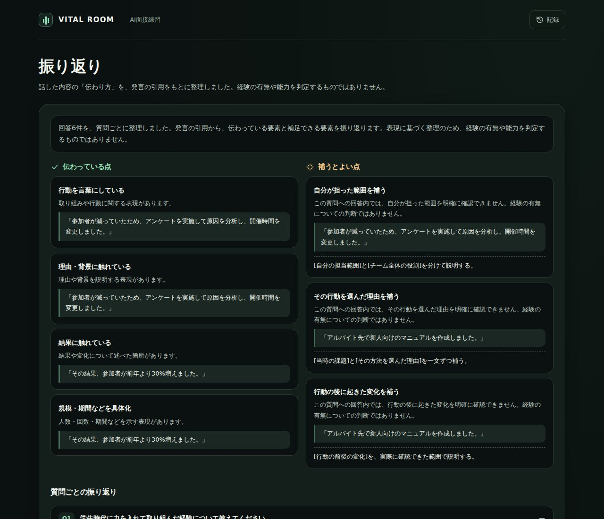
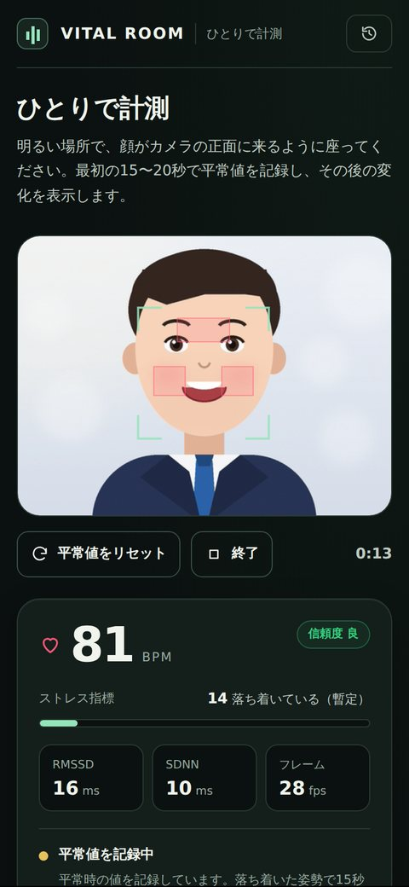

# VITAL ROOM — Web 版（サーバー不要）

**公開ページ: https://haru-ki417.github.io/Harinezumi-AI-Hack/**

チーム「Life & Medical Hackers」で開発した **VITAL ROOM（フル版）** をもとに、計測と面接練習の機能をサーバーなしでブラウザーだけで動くように移植した、**追加の版** です。
スマホ・タブレット・パソコンでページを開くだけで使えます（インストール・登録不要）。
フル版のコード（`vital-room/frontend`・`vital-room/backend`）には手を加えていません。

## 2 つの版

| | フル版（チームで開発） | Web 版（このフォルダー） |
|---|---|---|
| 置き場所 | `vital-room/frontend`（Next.js）・`vital-room/backend`（FastAPI） | `vital-room/web`（ビルド不要の静的サイト） |
| 動かし方 | サーバーを起動する（[使い方](../README.md#クイックスタート)） | ページを開くだけ |
| 心拍の計算 | サーバー（Python） | 端末のブラウザー（Python 版を JavaScript に移植） |
| 企業向けの面接管理・応募者の招待・集計 | あり（[企業向け面接の使い方](../INTERVIEWS.md)） | なし |
| AI 面接 | あり（AI の音声・文章は外部の AI を使う設定も可） | あり（端末内の規則で深掘りと振り返り。読み上げはブラウザーの音声） |
| 2 人のルーム | あり（サーバー経由） | あり（P2P で直接） |



| ひとりで計測 | ルームで練習（2人） |
|---|---|
|  |  |

| AI面接練習の振り返り | スマートフォン |
|---|---|
|  |  |

※ スクリーンショットのカメラ映像は、動作確認用に描いたイラストの人物に脈拍（81・69 BPM）を埋め込んだ合成映像です。実在の人物ではありません。

## できること

| 画面 | 内容 |
|---|---|
| ひとりで計測 | カメラの映像から心拍（BPM）・心拍変動（RMSSD / SDNN）・平常時と比べたストレス指標を表示。結果は CSV でも保存できます。 |
| ルームで練習 | 2人用ルーム。ルームコードかリンクで招待し、話題（自己紹介・志望動機など）ごとにお互いの心拍の変化を記録します。映像通話つき／数値の共有だけ、を選べます。 |
| AI面接練習 | AI 面接官が質問し、回答に合わせて「理由・結果・学び」などを深掘り。終了後、発言を引用した振り返りと答え方の構成例を作ります。読み上げ・音声入力に対応（文字入力でも可）。 |
| 記録 | 保存した結果をこのブラウザーの中で見返せます（最大 50 件、いつでも削除可）。 |

## しくみ

すべての計算はブラウザーの中で行います。フル版のバックエンド（`backend/`）の処理をそのまま JavaScript に移植しています。

| フル版（Python） | Web 版（JavaScript） | 内容 |
|---|---|---|
| `vital/face.py` | `js/face.js` | 顔検出（Web 版は MediaPipe Face Detector）→ 額・両頬の ROI → YCrCb 肌マスクで平均 RGB |
| `vital/rppg.py` | `js/dsp.js` | POS 法（overlap-add）→ 線形トレンド除去 → 4 次 Butterworth 帯域通過（filtfilt）→ FFT・放物線補間で BPM、SNR から信頼度 |
| `vital/hrv.py` | `js/dsp.js` | ピーク検出（`find_peaks` 相当）→ 拍間隔 → RMSSD / SDNN、ベースライン比のストレス指標 |
| `vital/session.py` | `js/session.js` | 平滑化・外れフレームの除外・平常値の確立・異常判定 |
| `interview_questions.py` | `js/interview.js` | 深掘り質問の選択（同じ観点を繰り返さない・回答拒否や時間切れで次へ） |
| `interview_feedback.py` | `js/interview.js` | 発言の引用にもとづく振り返り（合否・性格・生体情報は使わない） |

移植の正しさは、同じ入力を Python 版と Web 版に与えて比較して確認しました（脈波の差 1e-11 以下、BPM・HRV・状態遷移・質問の選択・振り返りの内容が完全一致）。
`tests/logic.test.mjs` は依存パッケージなしで動く回帰テストです。

```bash
cd vital-room/web
node --test tests/*.test.mjs   # ロジックのテスト
python3 -m http.server 8080    # http://localhost:8080 で確認（カメラは localhost か https で動きます）
```

ビルドは不要です。外部ライブラリはバージョンを固定して CDN から読み込みます（`js/config.js`）。

- MediaPipe Tasks Vision 0.10.21（顔検出。モデルは Google 配布の BlazeFace short range）
- PeerJS 1.5.5（ルームの P2P 接続）

## プライバシー

- カメラ映像は端末の外に送りません。録画もしません。
- ルームでは相手と WebRTC で直接つながります。接続の仲介（シグナリング）にだけ PeerJS の公開サーバーを使い、映像・音声・数値はそこを通りません。自前の PeerServer を使う場合は URL に `?signal=ホスト名:ポート` を付けます。
- AI 面接の音声入力はブラウザーの音声認識機能を使います（Chrome では Google のサーバーで処理されます）。使いたくない場合はオフにして文字で回答できます。
- 記録はこのブラウザーの localStorage にだけ保存されます。

## 制限

- 医療機器ではありません。値は照明・動き・カメラの性能の影響を受ける参考値です。
- 2人とも厳しいファイアウォールの内側にいると P2P 接続できないことがあります（TURN サーバーは使っていません）。その場合はモバイル回線などでお試しください。
- 企業向けの面接管理・招待などはフル版（`frontend/` + `backend/`）の機能です（上の「2 つの版」）。

## 公開

`main` に push すると `.github/workflows/web.yml` がテストを実行し、このフォルダーのサイトを `gh-pages` 枝に置きます（GitHub Pages: Deploy from a branch → `gh-pages` / `(root)`）。
